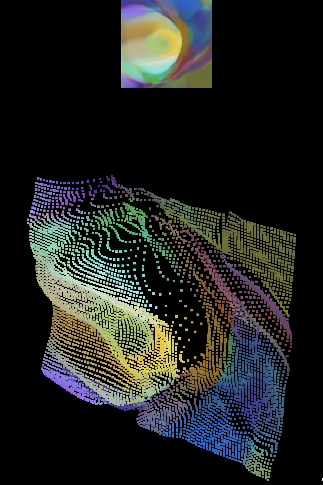

# CPPN in 3d!

[View Live!](https://silky.github.io/cppn-3d/javascript/index.html)

### TODO:

  - [x] Set up base yarn project

  - [x] Build cppn in tensorflow.js

  - [x] Simply render a random cppn in threejs

  - [x] Set up a dynamic system

  - [ ] Allow loading custom models which could be trained on arbitrary things (fashion-mnist, etc)

      

